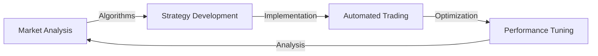
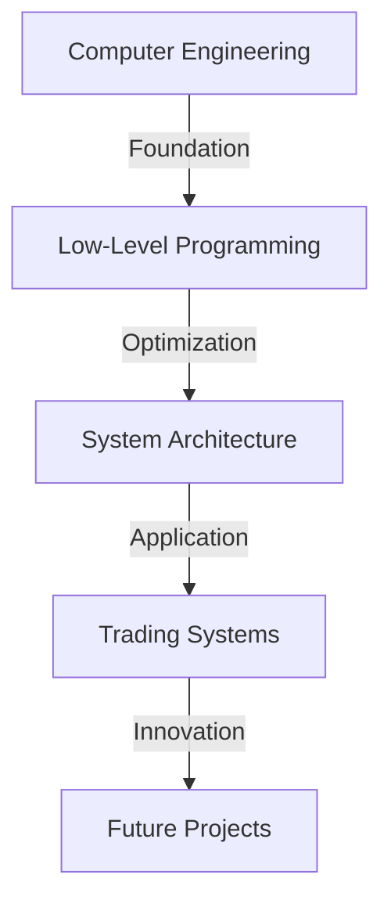

# 👋 Hey there! I'm Francisco Falk


## 🚀 About Me

20-year-old Computer Engineering student passionate about the intersection of finance and technology. I specialize in algorithmic trading and low-level programming, constantly pushing the boundaries of what's possible in automated trading systems.

```python
class Fran:
    def __init__(self):
        self.name = "Fran"
        self.age = 20
        self.location = "Argentina"
        self.role = "Computer Engineering Student"
        self.languages = ["C", "C++", "Python", "Assembly"]
        self.interests = ["Algorithmic Trading", 
                         "Low-Level Programming",
                         "Financial Markets",
                         "System Architecture"]
```

## 🎯 Current Focus

- 📈 Developing high-performance trading systems
- 💻 Exploring low-level system optimization
- 🔄 Implementing automated market strategies
- 🌐 Building robust financial algorithms

## 💡 Expertise Areas

### Trading & Finance


### Programming
```c
// My programming journey
struct Skills {
    char* languages[4] = {"C", "C++", "Python", "Assembly"};
    char* specialties[3] = {"Low-Level Programming",
                           "System Optimization",
                           "Algorithm Design"};
    char* current_focus = "High-Performance Trading Systems";
};
```

## 🛠 Tech Stack

### Languages & Tools
<div align="left">
    
    
    
    
</div>

### Currently Learning
- 🔍 Advanced C++ optimization techniques
- 🖥️ CUDA programming for parallel computing
- 📊 Machine Learning in financial markets
- 🔧 Hardware acceleration for trading systems

## 📈 Projects Highlight

### Trading Assistant
- High-performance bridge between Telegram and MT5
- Sub-millisecond execution times
- Advanced signal processing
- Real-time market analysis

```cpp
// Example of my coding style
template<typename T>
class TradingEngine {
private:
    std::vector<T> signals;
    std::atomic<bool> running;

public:
    void process_signal(const T& signal) {
        // High-performance signal processing
    }
};
```

## 🌱 Learning Path



## 🎯 Future Goals

- 🚀 Develop cutting-edge trading algorithms
- 🔬 Research in high-frequency trading
- 🌟 Contribute to open-source financial projects
- 📚 Share knowledge through technical articles

---

<p align="center">
    <i>⚡ "The best way to predict the future is to create it." ⚡</i>
</p>


